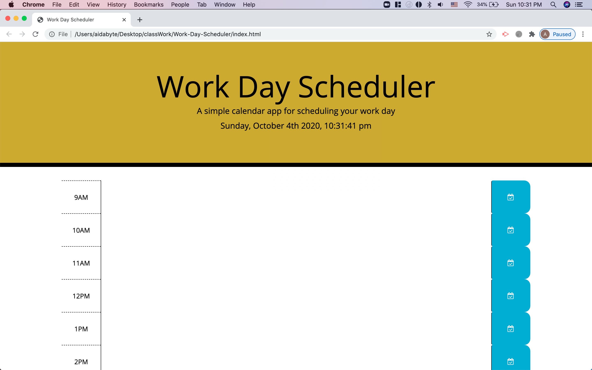

# Work Day Scheduler
 > A simple calendar application that allows a user to save events for each hour of the day.

 ## Table of contents
 * [General info](#general-info)
 * [Screenshots](#screenshots)
 * [Setup](#setup)
 * [Features](#features)
 * [Status](#status)
 * [Inspiration](#inspiration)
 * [Contact](#contact)

  ## General info
 A calender application that allows a user to save events for each hour of the day. This app will run in the browser and will be updated in HTML and CSS powered by jQuery,moment.js, and bootsrap.

  ## Screenshots
 

  ## Setup

  To get this project up and running follow the steps bellow.

  1. Navigate to the main page of the repository
 2. Under the repository name, click Clone or download
 3. In the Clone with HTTPSs section, click the copy
 4. Open Terminal
 5. Change the current working directory to the location where you want the cloned directory to be made.
 6. Type ‘git clone’ and then paste the URL you copied
 	- $ git clone https://github.com/aidabyte/Work-Day-Scheduler.git
 7. Press Enter. Your local clone will be created.

  ## Features
 1. Calendar planner
 2. Current day is displayed at the top of page
 3. Times colored depending on past, present, or future
 4. User is able to enter event

  ## Status
 Project is: _in progress_ because I am still learning.

  ## Inspiration
 Project inspired by homework given by Northwestern Coding bootcamp 2020

  ## Contact
 Created by [@aida](https://https://github.com/aidabyte) - feel free to contact me!
